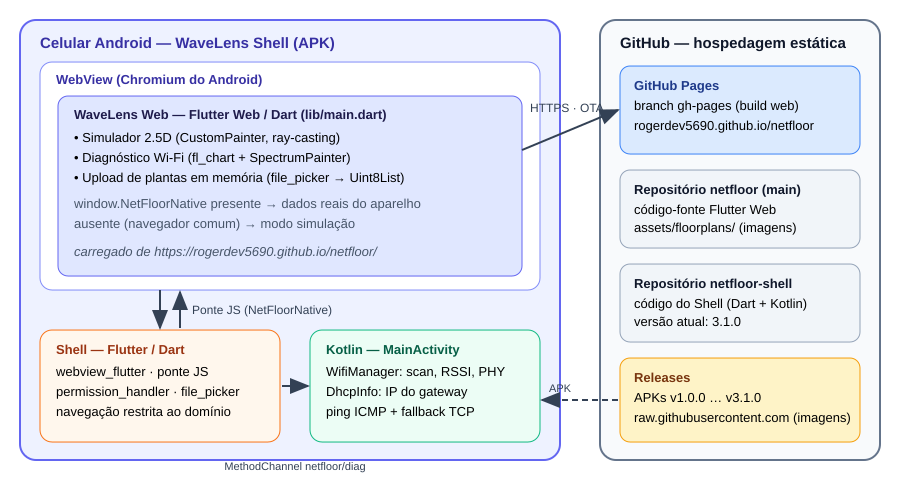
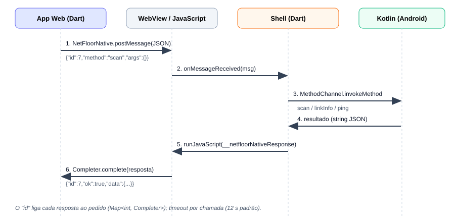
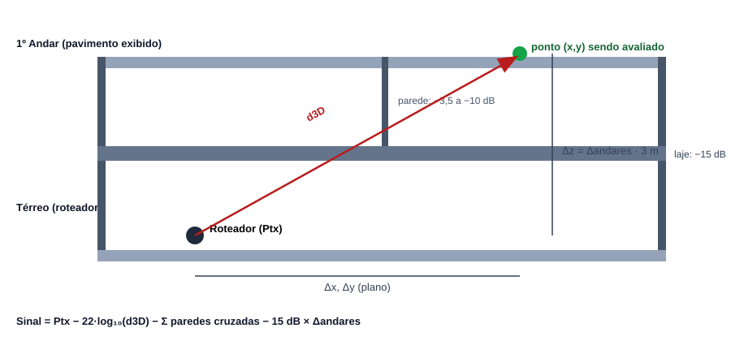

<!-- doc-version: 7.0 -->
<!-- doc-revision: 7.0.1 -->
<!-- doc-date: 19/09/2026 -->

## 1. Visão Geral e Proposta do Produto

### 1.1 Conceito

O **NetFloor** é um aplicativo com duas frentes complementares:

1. **Simulador de Cobertura Wi-Fi.** O usuário escolhe uma planta baixa, posiciona roteadores de modelos reais (com potência de transmissão própria) e vê, em tempo real, um **mapa de calor** de sinal sobreposto à planta. O cálculo considera a distância em 3D, a atenuação por paredes (ray-casting) e a atenuação por lajes entre pavimentos.
2. **Diagnóstico de Campo Nativo (NetFloor Diagnostic).** Uma aba que, quando executada dentro do aplicativo Android (NetFloor Shell), lê os dados **reais** do aparelho: espectro de canais em 2.4 GHz e 5 GHz com saúde do canal, sinal (RSSI) em tempo real e latência (ping duplo: roteador local versus DNS da Internet), além da velocidade PHY negociada. Fora do Shell (navegador comum), a aba funciona em **modo simulação** com dados fictícios, claramente identificados.

O nome da marca exibida ao usuário é **NetFloor**.

### 1.2 Casos de uso

| Perfil | Uso típico |
|---|---|
| Instalador / técnico de redes | Planejar onde posicionar roteadores ou APs antes da instalação; comparar modelos (Huawei, TP-Link Deco, UniFi). |
| Morador / pequeno escritório | Entender por que o Wi-Fi cai em certos cômodos; testar cobertura em sobrados e prédios com vários andares. |
| Diagnóstico em campo | Caminhar pelo ambiente observando o RSSI (walk-through), escolher o melhor canal e medir latência até o roteador e até a Internet. |

### 1.3 Módulos em resumo

| Módulo | Onde roda | Fonte dos dados |
|---|---|---|
| Simulador 2.5D (mapa de calor) | Navegador, PWA e Shell Android | Modelo matemático (seção 3) |
| Espectro de canais e saúde do canal | Shell Android (real); navegador (simulação) | `WifiManager.getScanResults()` |
| Monitor de sinal (walk-through) | Shell Android (real); navegador (simulação) | `WifiInfo.getRssi()` a cada 1 s |
| Latência e rede (ping duplo) | Shell Android (real); navegador (simulação) | `ping` do sistema; `DhcpInfo` |
| Biblioteca e upload de plantas | Todos os ambientes | Assets, rede (GitHub) e bytes em memória |

### 1.4 Arquitetura Serverless / PWA

O NetFloor **não possui servidor próprio, banco de dados ou API**. Todo o produto é composto de arquivos estáticos:

- O **aplicativo web** (Flutter Web compilado para JavaScript) é publicado em **GitHub Pages**, no endereço `https://rogerdev5690.github.io/netfloor/`.
- O **NetFloor Shell** é um APK Android que abre esse endereço dentro de uma `WebView` e acrescenta capacidades nativas (Wi-Fi, ping, seletor de arquivos) por meio de uma ponte JavaScript.
- Toda a lógica de negócio vive no navegador/WebView; nada é enviado a servidores de terceiros além do carregamento de arquivos estáticos do GitHub.

**Atualização OTA (over-the-air).** Como a interface vem do site, publicar uma nova versão do site atualiza o aplicativo instalado no celular na próxima abertura, sem reinstalar o APK. O APK só precisa ser reinstalado quando algo **nativo** muda (código Kotlin, permissões, versão do Shell). Para garantir isso, o build web usa `--pwa-strategy=none` (sem cache agressivo de service worker).



## 2. Arquitetura de Software e Stack Tecnológica

### 2.1 Stack

| Camada | Tecnologia | Versão / observação | Função |
|---|---|---|---|
| Frontend Web/PWA | **Flutter / Dart** | Flutter 3.47.4 (stable), Dart 3.13.3 | Interface, simulador, diagnóstico |
| Renderização 2D | `CustomPainter`, `Canvas`, `ImageFiltered` | SDK Flutter | Mapa de calor, ícones dos roteadores, espectro |
| Gráficos de linha | `fl_chart` | ^1.2.0 | Sinal (RSSI) e latência |
| Upload de arquivos | `file_picker` | ^13.1.0 | Plantas em memória (`Uint8List`) |
| Interop Web | `dart:js_interop`, `dart:js_interop_unsafe` | SDK Dart | Ponte com o Shell |
| Android Shell (UI) | **Flutter / Dart** | Shell 3.1.0 (build 4) | Hospeda a WebView e a ponte |
| WebView | `webview_flutter` + `webview_flutter_android` | ^4.10.0 / ^4.14.1 | Exibe o site e injeta `NetFloorNative` |
| Permissões | `permission_handler` | 12.0.1 | Localização e Nearby Wi-Fi |
| Android nativo | **Kotlin** | JDK 17 (Temurin 17.0.20) | `WifiManager`, ping, `DhcpInfo` |
| Build Android | Gradle + AGP (template Flutter) | SDK 36, build-tools 35/36 | Empacotamento do APK |
| Hospedagem | **GitHub Pages** | branch `gh-pages` | Servir o app web |
| Distribuição do APK | **GitHub Releases** | `gh release create` | Baixar/instalar o Shell |
| Automação local | PowerShell, Bash, `gh` CLI, `git` | Windows 11 | Build, deploy e versionamento |

### 2.2 Repositórios e estrutura de pastas

| Repositório | Conteúdo |
|---|---|
| `github.com/Rogerdev5690/netfloor` (branch `main`) | Código-fonte do app web, assets das plantas e esta documentação (`docs/`) |
| `github.com/Rogerdev5690/netfloor` (branch `gh-pages`) | Build web publicado (gerado, sobrescrito a cada deploy) |
| `github.com/Rogerdev5690/netfloor-shell` (branch `main`) | Código do Shell Android (Dart + Kotlin) |
| `github.com/Rogerdev5690/netfloor/releases` | APKs do Shell (v1.0.0 a v3.1.0) |

Estrutura local (`C:\Users\Roger\Desktop\Nova pasta\`):

```text
netfloor/                      # app web (Flutter)
  lib/main.dart                # todo o código do app (arquivo único, ~3.100 linhas)
  assets/floorplans/           # imagens das plantas
  pubspec.yaml
  run_web.bat                  # servidor de desenvolvimento (porta 8090)
  docs/                        # esta documentação
    DOCUMENTACAO.md            # fonte da documentação
    build_pdf.py               # gerador do PDF
    diagramas/*.svg            # diagramas
    Documentacao_Tecnica_App.pdf
  android/                     # legado: build nativo da v1.0.0 (não usado)
netfloor_shell/                # Shell Android
  lib/main.dart                # WebView + ponte JS
  android/app/src/main/
    AndroidManifest.xml        # permissões
    kotlin/com/netfloor/netfloor_shell/MainActivity.kt
```

### 2.3 Frontend Web/PWA (`lib/main.dart`)

O arquivo único é dividido em duas partes:

| Parte | Conteúdo | Classes principais |
|---|---|---|
| Raiz | Aplicativo e navegação inferior (Simulador / Diagnóstico) | `NetFloorApp`, `NetFloorShell` |
| Parte 1 — Simulador | Catálogo, plantas, física de sinal, pintura e tela | `RouterModelSpec`, `FloorPlanDef`, `ProjectDef`, `NetworkModel`, `HeatmapPainter`, `FloorPlanPainter`, `RouterDevicePainter`, `RadarPingPainter`, `SimulatorPage` |
| Parte 2 — Diagnóstico | Ponte nativa, modelos de dados, fontes de dados, controlador e três abas | `NativeBridge`, `WifiNetwork`, `LinkInfo`, `DiagnosticsSource`, `NativeBridgeDiagnostics`, `SimulatedDiagnostics`, `DiagnosticsController`, `DiagnosticPage`, `SpectrumTab`, `SpectrumPainter`, `SignalTab`, `LatencyTab` |

**Gerenciamento de estado.** Usa-se `ChangeNotifier` com `AnimatedBuilder`, sem bibliotecas externas. `NetworkModel` guarda projeto, pavimentos e roteadores do simulador; `DiagnosticsController` guarda varredura, amostras de sinal e de ping. Durante o arraste de um roteador só a camada do mapa de calor é redesenhada, mantendo a interação fluida.

**Composição visual.** A tela do simulador é um `Stack` de quatro camadas: (1) imagem ou desenho da planta, (2) mapa de calor com desfoque, (3) anéis pulsantes dos roteadores, (4) ícones dos roteadores (arrastáveis).

**Navegação.** Uma `NavigationBar` alterna entre Simulador e Diagnóstico dentro de um `IndexedStack`, preservando o estado das duas telas. Cada tela tem seu `TickerMode`, de modo que animações e temporizadores da aba oculta ficam parados.

### 2.4 Android Shell

O Shell é um aplicativo Flutter mínimo cujo corpo é uma `WebView` em tela cheia.

| Responsabilidade | Implementação |
|---|---|
| Carregar o app | `WebViewController.loadRequest` para `https://rogerdev5690.github.io/netfloor/` |
| Proteger a ponte | `onNavigationRequest` só permite o host `rogerdev5690.github.io`; qualquer outra navegação é bloqueada |
| Tratar falha de rede | Tela "Não foi possível carregar" com botão de nova tentativa (apenas para erros do quadro principal) |
| Expor a ponte | `addJavaScriptChannel('NetFloorNative', ...)` |
| Permissões em tempo de execução | `permission_handler`: `locationWhenInUse` e `nearbyWifiDevices` |
| Seletor de arquivos | `AndroidWebViewController.setOnShowFileSelector` chama `FilePicker.pickFile`/`pickFiles` e devolve URIs |
| Acesso ao Wi-Fi | `MethodChannel('netfloor/diag')` para o Kotlin |

### 2.5 Ponte de Comunicação (JS Bridge)

A ponte é **bidirecional** e assíncrona, baseada em mensagens JSON com identificador de correlação.



**Formato das mensagens**

```javascript
// App Web -> Shell (NetFloorNative.postMessage)
{ "id": 7, "method": "ping", "args": { "host": "8.8.8.8" } }

// Shell -> App Web (window.__netfloorNativeResponse)
{ "id": 7, "ok": true,  "data": { "ms": 21.4 } }
{ "id": 7, "ok": false, "error": "mensagem de erro" }
```

**Métodos disponíveis**

| Método | Argumentos | Resposta (`data`) | Timeout no app web |
|---|---|---|---|
| `hello` | — | `{ platform, shellVersion }` | 12 s |
| `permissions` | — | `{ location, nearby, locationServices }` (booleanos) | 90 s (usuário decide) |
| `scan` | — | `{ networks: [...], scanStarted, error? }` | 20 s |
| `linkInfo` | — | `{ connected, ssid, bssid, rssi, linkSpeed, frequency, gateway, ip }` | 12 s |
| `ping` | `host` | `{ ms }` (`null` se perdido) | 8 s |

**Como funciona.**

1. No lado web, `NativeBridge.available` é verdadeiro quando existe `window.NetFloorNative` (injetado pela WebView do Shell). Cada chamada gera um `id` incremental e guarda um `Completer` em um mapa.
2. A resposta chega pela função global `window.__netfloorNativeResponse`, registrada pelo próprio app web na primeira chamada. O `id` localiza o `Completer` correspondente.
3. No Shell, a resposta é serializada duas vezes (`jsonEncode(jsonEncode(...))`) para formar um literal de string JavaScript válido antes de `runJavaScript`.
4. Estourando o tempo limite, a chamada lança `TimeoutException` e a UI mostra o erro da respectiva aba.

**Segurança.** A ponte só existe na WebView do Shell, e o Shell bloqueia navegação para domínios diferentes do GitHub Pages do projeto. Métodos desconhecidos são rejeitados (`UnsupportedError`). O `ping` valida o nome do host por expressão regular antes de executar.

## 3. Motor do Simulador e Engenharia de RF

### 3.1 Fórmula de propagação

Para cada ponto $(x, y)$ do pavimento exibido, o sinal é o **máximo** entre os roteadores da rede (união da cobertura de uma rede mesh):

$$S(x,y) = \max_{i}\big( P_{tx,i} - 22\cdot\log_{10}(d_{3D,i}) - \sum L_{parede} - L_{laje,i} \big)$$

Onde:

| Símbolo | Significado |
|---|---|
| $P_{tx,i}$ | Potência de transmissão do roteador $i$, em dBm, definida pelo modelo (seção 3.2) |
| $d_{3D,i}$ | Distância tridimensional entre o roteador e o ponto, em metros (mínimo de 1 m) |
| $\sum L_{parede}$ | Soma da atenuação das paredes cruzadas pelo raio entre roteador e ponto |
| $L_{laje,i}$ | Perda por laje: 15 dB para cada pavimento de diferença |

O coeficiente 22 corresponde a um expoente de perda de percurso aproximado de 2,2 (`22 = 10·n`), valor definido no requisito do projeto.

### 3.2 Catálogo de hardware

| Modelo | Potência base ($P_{tx}$) | Ícone (desenhado por `CustomPainter`) |
|---|---|---|
| Huawei AX3 Pro / AX3s | 18 dBm | Roteador de mesa, corpo escuro, 4 antenas externas, LED verde |
| TP-Link Deco (Mesh) | 23 dBm | Torre/cilindro branco minimalista, sem antenas |
| Ubiquiti UniFi (AP Pro) | 28 dBm | Disco de teto circular com anel de luz azul central |

A escolha do modelo é feita por uma `BottomSheet` ao tocar em **Adicionar Roteador**; o modelo selecionado também é o padrão para roteadores inseridos por toque na planta.

### 3.3 Distância 3D e escala

A planta é medida em pixels e convertida para metros com a constante `kPixelsPerMeter = 45`. O pé-direito entre pisos é `kFloorHeightM = 3,0 m`.

$$d_{3D} = \sqrt{(\Delta x)^2 + (\Delta y)^2 + (\Delta z \cdot h)^2}$$

$$\Delta z = |a_{\text{roteador}} - a_{\text{exibido}}|, \qquad d = \max\big(d_{3D,px} / 45,\ 1\big)$$

Onde $a$ é o índice do andar (0 = térreo) e $h = 3\ \text{m}$. As posições dos roteadores são guardadas como **frações** (0 a 1) da planta, não em pixels; isso evita desalinhamento ao redimensionar a janela e permite comparar andares com proporções diferentes.

### 3.4 Física de barreiras (ray-casting)

Cada planta tem uma lista de **segmentos de parede** (`WallSegment`) em coordenadas fracionárias, com uma atenuação em dB. Para cada célula da grade e cada roteador, o motor traça o segmento de reta entre eles e soma a atenuação de **todas as paredes que o raio cruza**.

O teste de interseção usa a orientação de pontos (caso geral):

```dart
bool _segmentsIntersect(Offset p1, Offset p2, Offset p3, Offset p4) {
  double orient(Offset a, Offset b, Offset c) =>
      (b.dx - a.dx) * (c.dy - a.dy) - (b.dy - a.dy) * (c.dx - a.dx);
  final o1 = orient(p1, p2, p3), o2 = orient(p1, p2, p4);
  final o3 = orient(p3, p4, p1), o4 = orient(p3, p4, p2);
  return ((o1 > 0) != (o2 > 0)) && ((o3 > 0) != (o4 > 0));
}
```

| Tipo de barreira | Atenuação usada | Onde aparece |
|---|---|---|
| Parede leve / divisória de varanda | 3,5 dB | Varandas e terraços |
| Parede interna padrão | 6,0 dB (padrão) | Divisórias entre cômodos |
| Parede pesada | 10,0 dB | Parede central do escritório |
| Laje de concreto | 15 dB por andar | Entre pavimentos |

As paredes de cada planta são **aproximações** desenhadas a partir da imagem (não medidas a laser). As paredes usadas no cálculo de um andar são as do pavimento exibido.

### 3.5 Arquitetura 2.5D multi-pavimento

Um **projeto** (`ProjectDef`) tem um ou mais **pavimentos** (`FloorDef`), e cada pavimento usa uma planta (`FloorPlanDef`).

- **Seletor de pavimento:** uma linha de chips (Térreo, 1º Andar, 2º Andar…) acima da planta, com o número de roteadores de cada andar.
- **Botão "+ Pavimento":** acrescenta andares ao projeto atual a partir de imagens do dispositivo.
- **Roteadores de outros andares** aparecem esmaecidos (opacidade 0,55, sem interação) no andar exibido, indicando a origem do sinal.
- **Suposição:** os pavimentos são empilhados sobre a mesma pegada, isto é, a mesma posição fracionária $(x, y)$ em cada andar.



### 3.6 Exemplos numéricos

| Caso | Cálculo | Sinal | Cor aproximada |
|---|---|---|---|
| Huawei (18 dBm), 4 m, mesmo andar, 1 parede de 6 dB | $18 - 22\log_{10}(4) - 6 = 18 - \text{13,25} - 6$ | −1,2 dBm | verde |
| Mesmo Huawei, ponto logo acima (1 andar, $d_{3D}$ = 3 m) | $18 - 22\log_{10}(3) - 15 = 18 - \text{10,50} - 15$ | −7,5 dBm | ciano/azulado |
| UniFi (28 dBm), 10 m, mesmo andar, sem paredes | $28 - 22\log_{10}(10) = 28 - 22$ | +6,0 dBm | verde/amarelo |

### 3.7 Visualização do mapa de calor

**Amostragem.** A planta é dividida em uma grade de células de 8 px. Para cada célula avalia-se $S(x,y)$ e converte-se em cor e transparência.

**Escala.** O sinal é normalizado por $t = \text{clamp}\big((S + 30)/56,\ 0,\ 1\big)$, ou seja, −30 dBm mapeia para $t=0$ e +26 dBm para $t=1$ (próximo à potência máxima do catálogo).

| $t$ | Cor (paleta "jet") |
|---|---|
| 0,00 | Azul profundo `#1E3A8A` |
| 0,18 | Azul `#2563EB` |
| 0,38 | Ciano `#06B6D4` |
| 0,58 | Verde `#22C55E` |
| 0,74 | Amarelo `#FACC15` |
| 0,88 | Laranja `#FB923C` |
| 1,00 | Vermelho `#EF4444` |

**Transparência.** A opacidade cresce suavemente (interpolação *smoothstep* entre $t=\text{0,04}$ e $t=\text{0,55}$) até o máximo configurável. O padrão é **48 %**; o usuário ajusta entre 15 % e 90 % em uma folha inferior (ícone de gota na barra superior). Regiões sem cobertura ficam transparentes, deixando a planta visível.

**Suavização.** A camada é desfocada (`ImageFilter.blur`, sigma 9) para remover o aspecto quadriculado.

**Legenda.** Os limiares exibidos derivam da própria escala: **Forte** ≥ 12 dBm; **Intermediário** de −10 a 12 dBm; **Ruim** < −10 dBm.

### 3.8 Interação

| Ação | Comportamento |
|---|---|
| Tocar em área livre da planta | Insere um roteador do modelo atual naquele ponto |
| Botão "Adicionar Roteador" | Abre a seleção de modelo e insere o roteador no centro (com pequeno deslocamento para não sobrepor) |
| Arrastar um roteador | `onPanUpdate` move o roteador dentro dos limites da planta; o mapa de calor é recalculado a cada quadro |
| Tocar em um roteador existente | Não cria um roteador duplicado |
| Botão "Limpar" | Remove todos os roteadores (de todos os andares) |
| Anéis pulsantes | Dois anéis expansivos por roteador (ciclo de 2,4 s) sugerem a emissão de sinal |

### 3.9 Limitações do modelo

- É um modelo **simplificado** de perda de percurso, seguindo a fórmula do requisito; não modela multipercurso, difração, frequência (2.4 × 5 GHz), interferência entre roteadores nem materiais reais.
- A escala é fixa (45 px por metro) e não usa as medidas reais de cada planta.
- As paredes são aproximações visuais; plantas enviadas pelo usuário não têm paredes mapeadas (só atenuação por distância e por lajes).
- Em imagens em perspectiva 3D as paredes do cálculo são apenas indicativas.

## 4. Módulo de Diagnóstico Mobile (Android Nativo)

### 4.1 Modos de operação

| Modo | Condição | Dados | Indicação na tela |
|---|---|---|---|
| **Nativo** | `window.NetFloorNative` existe (WebView do Shell) | Reais, do aparelho | Faixa verde: "Dados reais do aparelho Android." |
| **Simulação** | Navegador comum ou PWA | Fictícios | Faixa amarela: "Modo simulação: dados fictícios…" |

A fonte de dados é escolhida por `DiagnosticsController`: começa em `SimulatedDiagnostics` e troca para `NativeBridgeDiagnostics` assim que a ponte é detectada, limpando os dados anteriores. Ambas implementam `DiagnosticsSource` (`ensurePermissions`, `scan`, `linkInfo`, `ping`).

### 4.2 Requisitos e permissões do Android

| Requisito | Motivo |
|---|---|
| Permissão de **Localização** concedida | O Android só devolve redes Wi-Fi e SSID/BSSID a apps com localização |
| **GPS / Localização do aparelho ligada** | Sem ela `getScanResults` retorna vazio a partir do Android 9 |
| `NEARBY_WIFI_DEVICES` (Android 13+) | Alternativa moderna de permissão para varredura |
| Limite de varreduras | O Android limita `startScan` (cerca de 4 a cada 2 minutos em primeiro plano); nesse caso retorna o último resultado em cache |

Se a permissão for negada, ou a localização estiver desligada, um cartão laranja explica o problema e oferece o botão **Conceder**.

### 4.3 Aba Espectro e Saúde do Canal

**Coleta.** O Kotlin chama `WifiManager.startScan()` e lê `scanResults`. Para cada rede são enviados: SSID, BSSID, frequência do canal primário, frequência central do bloco (`centerFreq0`), largura (20/40/80/160 MHz), nível em dBm e um indicador `connected` (comparação do BSSID com o da conexão atual). Redes fora de 2.4 GHz e 5 GHz (por exemplo 6 GHz) são descartadas.

**Relação canal ⇄ frequência.**

$$f_{\text{2,4}}(c) = 2407 + 5c \quad (c = 1..13;\ c = 14 \Rightarrow 2484\ \text{MHz}), \qquad f_{5}(c) = 5000 + 5c$$

**Desenho.** `SpectrumPainter` desenha um **trapézio por rede**: a base tem a largura do canal, a altura é proporcional ao nível (eixo de −100 a −30 dBm) e o topo é 10 % mais estreito. O eixo X cobre 2396–2498 MHz (2.4 GHz) e 5160–5840 MHz (5 GHz). No 5 GHz o gráfico tem largura mínima de 980 px e rola horizontalmente para que todos os canais fiquem legíveis.

| Elemento | Estilo |
|---|---|
| Rede conectada | Verde aceso (`#00E676`) com brilho, preenchimento, contorno, **barra sublinhada no eixo** e rótulo sublinhado com SSID e dBm |
| Mesmo SSID em outra banda | Tratado como "sua rede": ex.: você está no 5 GHz e o 2.4 GHz do mesmo roteador aparece em destaque com o sufixo "· sua rede" |
| Redes vizinhas | Cinza translúcido; rótulos só das 4 mais fortes, para evitar poluição |

Um cartão **Rede conectada** mostra SSID, BSSID, banda e canal, largura em MHz e nível em dBm. Se o Android ocultar o BSSID (sem permissão), o campo exibe "oculto pelo Android".

**Saúde do canal.** Para cada canal de 20 MHz calcula-se uma pontuação de interferência a partir das redes vizinhas. A sua própria rede (conectada e as de mesmo SSID) fica **de fora**.

$$o_{c,n} = \text{clamp}\Big(\frac{\min(f_c + 10,\ hi_n) - \max(f_c - 10,\ lo_n)}{20},\ 0,\ 1\Big), \qquad s_n = \text{clamp}\Big(\frac{RSSI_n + 95}{55},\ 0,\ 1\Big)$$

$$\text{score}_c = \sum_{n} o_{c,n}\cdot s_n$$

Onde $[lo_n, hi_n]$ é o bloco de frequências ocupado pela rede $n$ (centro ± largura/2).

| Pontuação | Classificação |
|---|---|
| < 0,25 | **Excelente** |
| 0,25 a < 1,0 | **Bom** |
| ≥ 1,0 | **Ruim** |

São avaliados os canais 1–13 (2.4 GHz) e 25 canais de 5 GHz (36–64, 100–144, 149–165). A tela lista os **3 canais recomendados** (menor pontuação) e uma tabela completa com canal, frequência, barra de interferência, número de redes sobrepostas e classificação.

**Atualização.** A varredura roda ao abrir a aba e a cada 30 s enquanto ela estiver visível; há também o botão **Escanear**.

### 4.4 Aba Sinal (walk-through)

O aplicativo lê o RSSI da conexão atual a cada **1 segundo** e mantém as últimas 60 amostras em um gráfico de linha (`fl_chart`). Linhas tracejadas de referência marcam −60 dBm e −70 dBm. A tela mostra o valor atual, SSID, banda e canal, além de mínimo, média e máximo da janela.

| RSSI | Classificação |
|---|---|
| ≥ −50 dBm | Excelente |
| −50 a −60 dBm | Muito bom |
| −60 a −70 dBm | Bom |
| −70 a −80 dBm | Fraco |
| < −80 dBm | Muito fraco |

Os botões **Pausar/Retomar** e **Limpar** controlam a coleta. O uso típico é caminhar pelo ambiente e observar as quedas do gráfico.

### 4.5 Aba Latência e Rede (ping duplo)

A cada segundo o aplicativo mede, **em paralelo**, a latência até:

1. **Gateway local**: IP do roteador obtido de `DhcpInfo.gateway` (atualizado a cada 5 ciclos).
2. **DNS da Internet**: `8.8.8.8`.

| Indicador | Origem |
|---|---|
| Perda de pacotes (%) | $\text{perdidos}/\text{enviados} \times 100$, por alvo |
| Latência DNS (ms) | Última medição e média |
| Latência do gateway (ms) | Última medição, média e IP |
| Velocidade PHY (Mbps) | `WifiInfo.getLinkSpeed()` (taxa negociada com o roteador) |

**Implementação do ping no Android.** O Kotlin executa `/system/bin/ping -c 1 -W 2 <host>` e extrai o valor `time=` da saída. Se o binário não puder ser executado, usa-se um **fallback TCP**: mede-se o tempo de `connect` nas portas 53 e 80 (conexão recusada também prova alcance). O nome do host é validado antes da execução.

**Interpretação.** Se só o DNS piora, o problema tende a estar fora de casa; se o gateway também piora, o problema é na rede local (Wi-Fi). Pacotes perdidos aparecem como lacunas no gráfico.

### 4.6 Controlador de diagnóstico

`DiagnosticsController` executa apenas o trabalho da **aba visível**, poupando bateria e respeitando os limites do Android.

| Aba | Temporizador | Proteções |
|---|---|---|
| Espectro | Varredura imediata + a cada 30 s | Não inicia nova varredura enquanto outra roda |
| Sinal | A cada 1 s (se "Retomar") | Ignora ciclos enquanto a leitura anterior não terminou |
| Latência | A cada 1 s (se "Retomar") | Idem; os dois pings rodam com `Future.wait` |

Ao trocar de aba ou de tela, os temporizadores são cancelados e recriados conforme necessário. As amostras permanecem guardadas quando o usuário alterna entre abas.

### 4.7 Modo simulação

`SimulatedDiagnostics` gera 13 redes fictícias (2.4 e 5 GHz, larguras variadas, uma rede conectada e o 2.4 GHz de mesmo nome), um RSSI que oscila como uma caminhada, IP de gateway `192.168.0.1`, latências plausíveis e ~3 % de perda. Serve para demonstrar a interface em qualquer navegador.

### 4.8 Estado de validação

| Item | Situação (na data desta revisão) |
|---|---|
| Modo simulação (3 abas) | Verificado no navegador |
| Ponte com dados no formato nativo | Verificada injetando uma ponte simulada no navegador |
| Dados reais no Android | **Validado em aparelho real** (Xiaomi Redmi Note 14 Pro): espectro 2.4/5 GHz, gateway `192.168.100.1`, PHY 390 Mbps |
| Seleção múltipla de imagens no Shell 3.1.0 | Compilado; ainda não validado em aparelho |
| Testes automatizados | Não há (o app usa `dart:js_interop`, que não executa na VM de testes) |

## 5. Gestão de Plantas e Mídia

### 5.1 Modelo de dados

| Classe | Campos principais | Papel |
|---|---|---|
| `ProjectDef` | `id`, `name`, `subtitle`, `floors`, `isCustom` | Um projeto na biblioteca (casa, prédio, upload) |
| `FloorDef` | `label`, `plan` | Um pavimento (Térreo, 1º Andar…) |
| `FloorPlanDef` | `id`, `name`, `subtitle`, `imageUrl?`, `assetPath?`, `memoryBytes?`, `aspectRatio`, `rooms`, `wallSegments` | Uma planta: aparência + física |
| `RoomDef` | `label`, `rectFrac` | Cômodo do desenho vetorial |
| `WallSegment` | `a`, `b`, `attenuationDb` | Parede para o ray-casting |

### 5.2 Cadeia de resolução da imagem

A planta de fundo é resolvida nesta ordem, com queda automática para a próxima opção em caso de falha:

1. **Memória** (`memoryBytes` → `Image.memory`): plantas enviadas pelo usuário.
2. **Rede** (`imageUrl` → `Image.network`, com indicador de carregamento): arquivo em `raw.githubusercontent.com`.
3. **Asset** (`assetPath` → `Image.asset`): arquivo embutido no app.
4. **Desenho vetorial** (`rooms` → `FloorPlanPainter`): piso texturizado, paredes espessas e silhuetas de móveis.

Isso permite deixar a **vaga** de uma planta reservada: enquanto o PNG não existir, o app mostra o desenho vetorial provisório; ao colocar o arquivo com o nome esperado em `assets/floorplans/`, a imagem passa a ser usada.

### 5.3 Biblioteca atual

| Projeto | Pavimentos | Fonte visual | Situação |
|---|---|---|---|
| Casa Térrea 2 Quartos (`casa_2q`) | 1 | `casa_2q.png` (736×1105 px) | Imagem limpa, com paredes aproximadas |
| Planta 01 — Apartamento 3 Quartos | 1 | `planta_01.png` (aguardando) | Desenho vetorial provisório |
| Planta 02 — Apartamento Open Space | 1 | `planta_02.png` (aguardando) | Desenho vetorial provisório |
| Planta 03 — Apartamento com Terraço | 1 | `planta_03.png` (aguardando) | Desenho vetorial provisório |
| Edifício Corporativo | 3 | `edificio_corporativo.png` (aguardando) | Planta vetorial repetida nos 3 andares (Open Space, Reunião, Diretoria, Copa) |

### 5.4 Como adicionar uma nova planta

1. Confirme que a imagem é **limpa** (sem marca d'água de terceiros e com direito de uso).
2. Copie o arquivo para `netfloor/assets/floorplans/` (o `pubspec.yaml` já inclui a pasta inteira).
3. No `main.dart`, crie um `FloorPlanDef` com `assetPath`, `imageUrl` (URL `raw.githubusercontent.com` após publicar no `main`) e `aspectRatio = largura / altura` da imagem.
4. Estime as paredes internas em coordenadas fracionárias (0 a 1) e cadastre os `WallSegment` (3,5 / 6 / 10 dB conforme a parede).
5. Inclua a planta em um `ProjectDef` na lista `kProjectLibrary`.
6. Publique (seção 6): commit no `main`, build web e deploy no `gh-pages`.

### 5.5 Upload em memória (`Uint8List`)

O botão **Carregar plantas do dispositivo** (biblioteca) e o chip **+ Pavimento** aceitam **uma ou várias** imagens (PNG, JPG, WEBP):

- A leitura usa `FilePicker.pickFiles(type: FileType.custom, allowedExtensions: [...])` e `PlatformFile.readAsBytes()`, obtendo um `Uint8List`. **Não há `dart:io`**, portanto a mesma lógica funciona em Web/PWA, no Shell Android e no desktop. (No `file_picker` 13 o parâmetro antigo `withData: true` não existe mais; os bytes vêm de `readAsBytes()`.)
- As dimensões são obtidas com `instantiateImageCodec`, definindo o `aspectRatio` sem esticar a imagem.
- Cada imagem vira um pavimento, na ordem de seleção (Térreo, 1º Andar…). No botão da biblioteca cria-se um **projeto novo**; no chip **+ Pavimento** os andares são **acrescentados** ao projeto atual.
- A planta fica só na memória da sessão e não tem paredes mapeadas.
- No Shell Android, o `<input type="file">` da página é atendido pelo seletor nativo (`setOnShowFileSelector`), com suporte a seleção múltipla a partir do Shell 3.1.0.

### 5.6 Política de conteúdo e licenças

- Somente imagens **limpas**, próprias ou licenciadas, devem entrar na biblioteca.
- Imagens com marca d'água de terceiros (por exemplo, prévias de bancos de imagens pagos ou de sites de projetos) **não** são incluídas nem têm a marca removida.
- Vagas de plantas cujo arquivo ainda não foi fornecido usam desenho vetorial próprio.

### 5.7 Histórico de alterações

| Versão | Data | Alterações |
|---|---|---|
| 1.0 | 14/09/2026 | Protótipo: duas plantas desenhadas em código (Casa e Apartamento), mapa de calor em 3 faixas (azul/verde/vermelho), toque para adicionar e arraste de roteadores |
| 1.1 | 15/09/2026 | Planta real como fundo; gradiente contínuo "jet" com desfoque; ícone de roteador; anéis pulsantes; correção do repaint do mapa de calor; publicação no GitHub Pages; primeiro APK nativo (release v1.0.0) |
| 2.0 | 15/09/2026 | Catálogo de roteadores (18/23/28 dBm); biblioteca de plantas; fórmula $P_{tx} - 22\log_{10}(d)$; **arquitetura OTA** (site + Shell WebView, release v2.0.0) |
| 4.0 | 15/09/2026 | Plantas ilustradas (piso, móveis, paredes espessas); **ray-casting de paredes**; overlay do calor a ~48 %; `Image.network` com fallback |
| 5.1 | 16/09/2026 | Plantas reais como assets (Casa 2 Quartos com correção de espelhamento, Casa 3 Quartos e Apartamento 2 Quartos, este com marca d'água de terceiros aceita pelo usuário na época) |
| 6.0 | 18/09/2026 | Upload de plantas em memória; **NetFloor Diagnostic** (espectro, sinal, latência); ponte JS + Kotlin; Shell 3.0.0; assets movidos para `assets/floorplans/` |
| 6.1 | 18/09/2026 | Destaque e sublinhado da rede conectada e da rede de mesmo SSID em outra banda; saúde do canal desconsidera a própria rede |
| 7.0 | 19/09/2026 | **Projetos com vários pavimentos (2.5D)**, distância 3D e perda de laje de 15 dB; posições dos roteadores em frações; upload em lote; novas plantas limpas; cartão "Rede conectada"; Shell 3.1.0 |
| 7.0.1 | 19/09/2026 | **Limpeza da biblioteca:** remoção do projeto Sobrado (térreo e 1º andar) e do arquivo `sobrado_1andar.png`; vagas `planta_01..03` com desenho provisório |

**Remoções relacionadas a marca d'água e conteúdo.**

| Item | Situação |
|---|---|
| `Apartamento 2 quartos.jpg` (marca `@opedreiro`) | Removido do código, da biblioteca e do site na v7.0 |
| Antigas Casa 2 Quartos e Casa 3 Quartos | Substituídas pela nova biblioteca na v7.0 |
| Sobrados (`sobrado_1andar.png` e desenho do térreo) | Removidos na v7.0.1 |
| Imagens com marca de terceiros enviadas depois (`montesuacasa.com.br`, `depositphotos`) | **Não incluídas** no projeto |

> **Observação importante:** a remoção é da **biblioteca, do código e do site publicado**. Os arquivos antigos continuam recuperáveis no **histórico de commits do Git** do repositório. Apagá-los de vez exige reescrever o histórico (`git filter-repo` e `push --force`), o que só deve ser feito com pedido explícito.

## 6. Guia de Instalação, Build e CI/CD

### 6.1 Ambiente de desenvolvimento (Windows 11)

| Componente | Local / versão |
|---|---|
| Flutter SDK | `C:\flutter` — 3.47.4 stable (Dart 3.13.3); `C:\flutter\bin` no PATH |
| JDK | Eclipse Temurin 17.0.20 — `JAVA_HOME = C:\Program Files\Eclipse Adoptium\jdk-17.0.20.101-hotspot` |
| Android SDK | `C:\Android\sdk` — `ANDROID_HOME`/`ANDROID_SDK_ROOT`; plataformas 35 e 36; build-tools 28.0.3, 35.0.0 e 36.0.0; `platform-tools` e `cmdline-tools` no PATH |
| Git e GitHub CLI | `git` e `gh` autenticado na conta do projeto |
| Navegador | Chrome/Edge para desenvolvimento web |

### 6.2 Dependências (`pubspec.yaml`)

**App web (`netfloor`)**

```yaml
dependencies:
  flutter:
    sdk: flutter
  cupertino_icons: ^1.0.6
  file_picker: ^13.1.0   # upload de plantas em memória (bytes), sem dart:io
  fl_chart: ^1.2.0       # gráficos de linha (sinal e latência)

dev_dependencies:
  flutter_lints: ^3.0.0

flutter:
  uses-material-design: true
  assets:
    - assets/floorplans/
```

**Shell Android (`netfloor_shell`)**

```yaml
version: 3.1.0+4
dependencies:
  flutter:
    sdk: flutter
  cupertino_icons: ^1.0.8
  webview_flutter: ^4.10.0
  webview_flutter_android: ^4.14.1
  permission_handler: 12.0.1   # a 13.x exige compileSdk 37 (não suportado pelo Gradle atual)
  file_picker: ^13.1.0         # seletor de arquivos para o <input type="file">
```

### 6.3 Permissões do Android (`AndroidManifest.xml` do Shell)

| Permissão | Uso |
|---|---|
| `INTERNET` | Carregar o app web e as imagens |
| `ACCESS_NETWORK_STATE` | Estado da conectividade |
| `ACCESS_WIFI_STATE` | Ler `WifiInfo`, `DhcpInfo` e resultados de varredura |
| `CHANGE_WIFI_STATE` | Solicitar `startScan()` |
| `ACCESS_FINE_LOCATION`, `ACCESS_COARSE_LOCATION` | Exigidas pelo Android para varredura Wi-Fi e leitura de SSID/BSSID |
| `NEARBY_WIFI_DEVICES` | Permissão de dispositivos Wi-Fi próximos (Android 13+) |

```xml
<uses-permission android:name="android.permission.INTERNET"/>
<uses-permission android:name="android.permission.ACCESS_NETWORK_STATE"/>
<uses-permission android:name="android.permission.ACCESS_WIFI_STATE"/>
<uses-permission android:name="android.permission.CHANGE_WIFI_STATE"/>
<uses-permission android:name="android.permission.ACCESS_FINE_LOCATION"/>
<uses-permission android:name="android.permission.ACCESS_COARSE_LOCATION"/>
<uses-permission android:name="android.permission.NEARBY_WIFI_DEVICES"/>
```

Identificação do Shell: `applicationId = com.netfloor.netfloor_shell`, rótulo **NetFloor**, `versionName 3.1.0`, `versionCode 4`. O APK é assinado com a **chave de debug** do Flutter (adequado a uso pessoal; a Play Store exigiria uma keystore própria).

### 6.4 Desenvolvimento local

```bat
cd "C:\Users\Roger\Desktop\Nova pasta\netfloor"
flutter pub get
run_web.bat         :: flutter run -d web-server --web-port 8090 --web-hostname 0.0.0.0
```

Acesse `http://localhost:8090`. Na primeira compilação a tela pode ficar preta por ~1 minuto; recarregue a página quando o terminal indicar que o app está sendo servido. Com `--web-hostname 0.0.0.0`, outros aparelhos da mesma rede acessam pelo IP do computador (pode ser necessário liberar a porta no Firewall do Windows).

### 6.5 Build web de produção

```bat
flutter build web --release --base-href "/netfloor/" --pwa-strategy=none
```

| Opção | Motivo |
|---|---|
| `--base-href "/netfloor/"` | O site é servido em um subcaminho do GitHub Pages |
| `--pwa-strategy=none` | Desliga o cache de service worker: cada abertura busca a versão mais recente (base do OTA). Como consequência, o app precisa de internet para abrir |

### 6.6 Pipeline de implantação contínua (OTA) via GitHub Pages

Não há GitHub Actions: o pipeline é manual e reproduzível, sempre nesta ordem.

1. **Commit e push do código** no `main` (assim as imagens ficam disponíveis em `raw.githubusercontent.com` antes do site que as referencia).
2. **Build web** (seção 6.5).
3. **Publicar** o conteúdo de `build/web` no branch `gh-pages` (histórico descartável, sobrescrito):

```bash
cd netfloor/build/web
rm -rf .git && git init -q && git checkout -q -b gh-pages
git add -A && git commit -q -m "Deploy: NetFloor vX.Y"
git remote add origin https://github.com/Rogerdev5690/netfloor.git
git push -f origin gh-pages
```

4. **Aguardar** o GitHub Pages (`gh api repos/Rogerdev5690/netfloor/pages/builds/latest --jq .status` até `built`) e conferir o site.
5. O aplicativo instalado carrega a nova versão **na próxima abertura**, sem reinstalar o APK.

### 6.7 Build e versionamento do APK Shell

```bat
cd "C:\Users\Roger\Desktop\Nova pasta\netfloor_shell"
:: pubspec.yaml -> version: 3.1.0+4  (e kShellVersion em lib/main.dart)
flutter build apk --release
gh release create v3.1.0 build/app/outputs/flutter-apk/app-release.apk#NetFloor-v3.1.0-shell.apk ^
  --repo Rogerdev5690/netfloor --title "NetFloor Shell v3.1.0" --notes "..."
```

| Release | Conteúdo |
|---|---|
| v1.0.0 | Primeiro APK nativo em Flutter (histórico; obsoleto) |
| v2.0.0 | Primeiro Shell WebView (arquitetura OTA) |
| v3.0.0 | Shell com diagnóstico nativo (ponte JS, Wi-Fi, permissões, seletor de arquivos) |
| v3.1.0 | Seleção múltipla de imagens no seletor de arquivos (**atual**) |

**Regra de versão do Shell:** incrementar o `versionCode` (o número após `+`) a cada APK novo; mudar o número maior quando houver novos recursos nativos. O APK atualiza o anterior por cima (mesmo `applicationId` e mesma chave de assinatura).

**Instalação no celular:** baixar o APK do release e instalar (o Android pede para permitir "instalar apps desconhecidos"), ou, com Depuração USB ativa, `adb install -r app-release.apk`. Em aparelhos Xiaomi pode ser necessário habilitar também "Instalar via USB".

### 6.8 Checklist de release

- [ ] `flutter analyze` sem erros no app web e no Shell.
- [ ] Teste no navegador: simulador, troca de andares, upload, três abas do diagnóstico em simulação.
- [ ] Commit e push no `main`; build web; deploy no `gh-pages`; site verificado.
- [ ] Se houve mudança nativa: novo APK, `versionCode` incrementado, release publicado.
- [ ] **Atualizar `docs/DOCUMENTACAO.md` e regenerar o PDF** (seção 8).

### 6.9 Solução de problemas

| Sintoma | Causa | Solução |
|---|---|---|
| "Building with plugins requires symlink support" | Plugins com pasta `windows/` exigem o Modo Desenvolvedor do Windows | O projeto web não usa a plataforma Windows; a pasta `windows/` foi removida |
| Gradle: `Failed to find target with hash string 'android-37'` | `permission_handler` 13 exige compileSdk 37 | Usar `permission_handler` 12.0.1 |
| Tela preta na 1ª abertura do servidor local | Compilação inicial do Flutter Web | Aguardar e recarregar |
| Espectro vazio no Android | Localização negada ou GPS desligado; limite de varreduras | Conceder permissão, ligar o GPS e tocar em **Escanear** |
| `adb devices` não lista o celular | Depuração USB desligada ou modo USB incorreto | Ativar Depuração USB (e "Instalar via USB" em Xiaomi) e autorizar o computador |
| Imagem da planta não aparece | URL do `raw.githubusercontent.com` ainda inexistente | Fazer push no `main`; o app usa o asset embutido como reserva |
| `withData` não existe no `file_picker` | API mudou na versão 13 | Usar `readAsBytes()` do `PlatformFile` |

### 6.10 Segurança e privacidade

- Nenhum dado do usuário é enviado a servidores: plantas enviadas ficam na memória; leituras Wi-Fi são exibidas localmente.
- O Shell só carrega o domínio do projeto; a ponte nativa não é acessível a outros sites.
- O ping usa apenas os destinos exibidos (gateway local e 8.8.8.8).
- As permissões de localização são usadas exclusivamente porque o Android as exige para varredura Wi-Fi.

## 7. Limitações Conhecidas e Pendências

| Tema | Descrição |
|---|---|
| Plantas provisórias | `planta_01..03` e `edificio_corporativo` aguardam imagens limpas; usam desenho vetorial |
| Proporção fixa por planta | O `aspectRatio` de cada planta é definido no código; ao trocar um PNG por outro de proporção diferente, o valor deve ser ajustado |
| Paredes aproximadas | Desenhadas visualmente, sem medidas reais; plantas enviadas não têm paredes |
| Modelo de RF simplificado | Ver seção 3.9 |
| Uso offline | Com `--pwa-strategy=none` o app exige internet para abrir |
| Assinatura do APK | Chave de debug: não serve para Play Store |
| Testes automatizados | Inexistentes; validação é manual |
| Histórico do Git | Arquivos removidos (por exemplo, com marca d'água) continuam nos commits antigos |
| Pasta `netfloor/android/` | Legado do APK nativo v1.0.0; o projeto atual depende de `dart:js_interop` e só compila para Web |
| Seleção múltipla no Shell 3.1.0 | Compilada, ainda não validada em aparelho |

## 8. Manutenção desta Documentação (Regra de Projeto)

Esta é a **versão base** da documentação. A cada nova atualização do aplicativo:

1. Implementar a alteração pedida.
2. Atualizar a(s) seção(ões) correspondente(s) de `docs/DOCUMENTACAO.md`, incluindo o **histórico de alterações** (seção 5.7) e, se necessário, a tabela de releases (6.7).
3. Ajustar as três marcas no topo do arquivo (`doc-version`, `doc-revision`, `doc-date`).
4. Regenerar o PDF e entregá-lo ao usuário:

```bat
python "C:\Users\Roger\Desktop\Nova pasta\netfloor\docs\build_pdf.py"
```

O script converte o Markdown em HTML (com fórmulas em MathML), imprime em PDF pelo Chrome em modo headless, calcula os números de página do sumário, acrescenta cabeçalho/rodapé com numeração e cria os marcadores (bookmarks) do PDF. Dependências Python: `markdown`, `latex2mathml`, `pygments`, `pypdf`, `reportlab`.

## Apêndice A — Glossário

| Termo | Significado |
|---|---|
| **dBm** | Decibel-miliwatt: unidade logarítmica de potência; valores mais próximos de 0 são sinais mais fortes (−50 dBm é melhor que −80 dBm) |
| **RSSI** | Received Signal Strength Indicator: nível de sinal recebido pelo aparelho |
| **SSID / BSSID** | Nome da rede / identificador (MAC) do ponto de acesso específico |
| **PHY (velocidade)** | Taxa de dados negociada na camada física entre aparelho e roteador (não é a velocidade da Internet) |
| **Canal / largura** | Faixa de frequência usada por uma rede (20, 40, 80 ou 160 MHz) |
| **Ray-casting** | Traçado de um raio entre dois pontos para contar obstáculos cruzados |
| **2.5D** | Simulação em planos empilhados (andares) sem modelo 3D completo |
| **Laje** | Estrutura horizontal de concreto entre pavimentos |
| **PWA** | Progressive Web App: aplicativo web instalável |
| **OTA** | Over-the-air: atualização sem reinstalar o aplicativo |
| **WebView** | Componente do Android que exibe páginas web dentro de um app |
| **Mesh** | Rede com vários nós que cooperam para ampliar a cobertura |

## Apêndice B — Referência rápida de constantes

| Constante | Valor | Onde |
|---|---|---|
| `kPixelsPerMeter` | 45 | Escala do simulador |
| `kFloorHeightM` | 3,0 m | Distância vertical entre andares |
| `kSlabLossDb` | 15 dB | Perda por laje |
| `_kDbmFloor` / `_kDbmCeil` | −30 / +26 dBm | Escala de cor do mapa de calor |
| `kDefaultHeatOpacity` | 0,48 | Opacidade padrão do calor |
| `_cell` (grade) | 8 px | Amostragem do mapa de calor |
| `kMaxSamples` | 60 | Amostras exibidas nos gráficos de linha |
| `kDnsHost` | `8.8.8.8` | Alvo do ping de Internet |
| Intervalo de varredura | 30 s | Aba Espectro |
| Intervalo de sinal e ping | 1 s | Abas Sinal e Latência |
